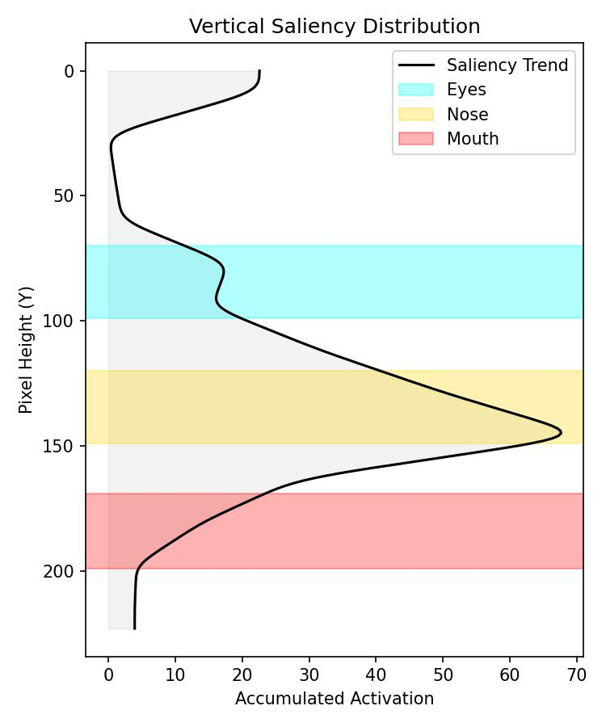
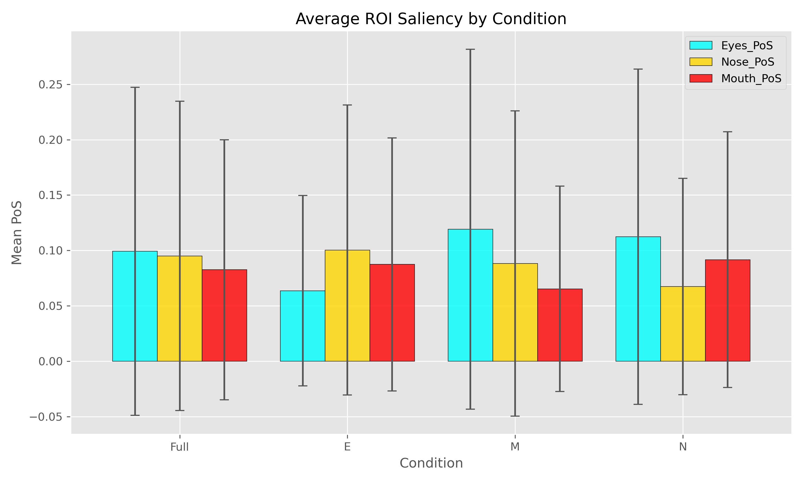

# Grad-CAM Analysis & Saliency Statistics Pipeline

<p align="center">
    <a href="https://jybmegan.github.io/SE-AlexNet/"></a>
    <a href="./LICENSE"></a>
</p>


<p align="center">
    <a href="./0_InputImages/"></a>
    <a href="https://huggingface.co/JiayuMBao/SE-AlexNet"></a>
</p>

## 1. Mathematical Formulation

This pipeline quantifies the visual attention of Convolutional Neural Networks (CNNs) using Grad-CAM (Gradient-weighted Class Activation Mapping) and calculates the **Proportion of Saliency** for specific Regions of Interest (ROIs).

### 1.1 Grad-CAM Calculation
For a given class $c$ and a convolutional layer with feature maps $A^k$, the neuron importance weights $\alpha_k^c$ are calculated by global average pooling the gradients:

$$
\alpha_k^c = \frac{1}{Z} \sum_{i} \sum_{j} \frac{\partial y^c}{\partial A_{ij}^k}
$$

The heatmap $L_{Grad-CAM}^c$ is a weighted combination of feature maps, followed by a ReLU activation to capture only features that have a positive influence on the class of interest:

$$
L_{Grad-CAM}^c = ReLU\left(\sum_{k} \alpha_k^c A^k\right)
$$

### 1.2 Proportion of Saliency (PoS)
We define the PoS for a specific ROI (e.g., Eyes, Nose, Mouth) as the ratio of the summed saliency within that region to the total saliency of the entire image:

$$
PoS_{ROI} = \frac{\sum_{(x,y) \in ROI} L_{Grad-CAM}^c(x,y)}{\sum_{x,y} L_{Grad-CAM}^c(x,y)}
$$


## 2. ROI Definitions

The analysis is performed on pre-processed aligned face images ($224 \times 224$). The coordinates for the Regions of Interest are defined as follows:

| Region | X-Range (Width) | Y-Range (Height)* | Visualization Color |
| :--- | :--- | :--- | :--- |
| **Eyes** | 52 - 171 | 70 - 99 | <span style="color:cyan">Cyan</span> |
| **Nose** | 52 - 171 | 120 - 149 | <span style="color:gold">Gold</span> |
| **Mouth** | 52 - 171 | 169 - 199 | <span style="color:red">Red</span> |

*\*Note: Coordinate origin (0,0) is at the top-left corner.*

## 3. Directory Structure

Ensure your project directory is organized as follows before running the pipeline:

```text
Project_Root/
├── All_Models_Collection/          # [INPUT] Directory containing all .pth model weights
│   ├── SE-Conv-L1_FaceBased_R4.pth
│   ├── Baseline_VGG16_ObjectBased.pth
│   └── ...
├── input_images/                   # [INPUT] Test images organized by mask condition
│   ├── Full/
│   │   ├── Full_1.jpg
│   │   └── ...
│   ├── E/                          # Eyes Masked
│   ├── M/                          # Mouth Masked
│   └── N/                          # Nose Masked
├── Results/                        # [OUTPUT] Auto-generated results directory
│   ├── GradCAM_Results.csv         # Main Data Table
│   ├── Summary_Statistics.csv      # Aggregated Stats (Mean/Std)
│   ├── ROI_Trend_Stats.csv         # Trend Analysis Stats (Peak/Lowest)
│   ├── Summary_Chart.png           # Bar Chart Visualization
│   ├── GradCAM_Images/             # Heatmaps (.jpg)
│   ├── Trend_Plots/                # Vertical Trend Curves (.jpg)
│   └── Datapoints/                 # Raw Matrices (.txt)
├── organize_models.py
├── organize_data.py
└── universal_GradCAM_pipeline.py   # Main execution script
```

## 4. Code Architecture

The pipeline is implemented in `universal_GradCAM_pipeline.py`. Below is a breakdown of the core components and their functions:

### 4.1 Configuration & Setup

**`ROIS` Dictionary**: Defines the coordinate boundaries and visualization colors for Eyes, Nose, and Mouth.

**Path Variables**: Sets input/output directories (`MODEL_DIR`, `INPUT_IMAGE_ROOT`, `OUTPUT_ROOT`).

**Control Flags**:
* `SAVE_IMAGES`: Toggles Grad-CAM heatmap generation.
* `SAVE_DATAPOINTS`: Toggles raw matrix (.txt) export.
* `SAVE_TREND_PLOTS`: Toggles vertical trend plot generation.

### 4.2 Dynamic Model Definition

The script uses a modular approach to instantiate neural networks based on the filename configuration.

**`UniversalSEAlexNet`**: A flexible AlexNet backbone that supports:

* **Baseline**: Standard AlexNet.
* **SE-Conv**: Squeeze-and-Excitation blocks inserted after Conv layers (Pos 1-4).
* **SE-FC**: SE blocks inserted after Fully Connected layers (Pos L1-L3).
* **Variable Reduction**: dynamically adjusts the reduction ratio (r=2, 4, 8, 16, 32).

**`UniversalVGG16`**: A standard VGG16 implementation for baseline comparisons.

**`SEBlock`**: Implementation of the Squeeze-and-Excitation mechanism with adaptive channel reduction.

### 4.3 Utilities & Helper Functions

**`parse_model_config(filename)`**: Regex-based parser that extracts architecture, base type (Face/Object), SE position, and reduction ratio from filenames.

**`resize_cam_tensor()`**: Uses `torch.nn.functional.interpolate` (Bilinear) to upscale the $13 \times 13$ feature maps to $224 \times 224$, removing dependencies on `cv2`.

**`calculate_roi_from_cam()`**: Performs the mathematical summation of pixels within defined ROI boundaries to calculate PoS.

**`calculate_trend_stats()`**: Analyzes the vertical projection of the heatmap to find the Peak Y-coordinate and identify which region (Eyes/Nose/Mouth) contains the maximum attention.

### 4.4 Visualization Engines
**`save_pure_heatmap()`**: Generates clean overlays of the heatmap on the original image using the 'Jet' colormap.

**`save_trend_visualization()`**:

* Computes the row-wise sum of saliency.
* Applies **Gaussian Smoothing** (`sigma=3`) for better readability.
* Plots the intensity curve against pixel height (Y-axis inverted).
* Overlays colored ROI bands (Cyan/Gold/Red) to correlate peaks with facial features.

**`generate_summary_report()`**: Aggregates data using Pandas to compute Mean/Std for each condition and generates a publication-ready Bar Chart.

### 4.5 Main Execution Loop (`main`)

1.  **Model Loading Strategy**: Implements a **Smart Fallback** mechanism. If a model fails to load due to a size mismatch (e.g., filename says R32 but weights are R4), it automatically attempts alternative reduction ratios until successful.

2.  **Hook Registration**: Registers forward/backward hooks on the last convolutional layer to capture gradients and feature maps.

3.  **Inference**: Iterates through every model, every mask condition (Full/E/M/N), and every image.

4.  **Data Export**: Saves all artifacts (Images, Txt, CSVs) to the designated folders.


## 5. Output Interpretation & Specification

This section explains how to interpret the generated CSV files and images, based on the specific output formats of the pipeline.

### 5.1 Main Data Table (`GradCAM_Results.zip`)
This file contains granular, per-image raw data. Each row represents one image processed by one model under one condition.

| Column Header | Description | Example / Interpretation |
| :--- | :--- | :--- |
| **ModelFile** | The filename of the model weights. | `SE-Conv-L1_FaceBased_R2.pth` |
| **Arch** | Model Architecture. | `AlexNet` or `VGG16` |
| **Location** | Where the SE block was inserted. | `1` (Conv1), `L3` (FC3), `Baseline` |
| **BaseType** | Pre-training dataset type. | `FaceBased` or `ObjectBased` |
| **Reduction** | The Squeeze Ratio used in the SE Block. | `2`, `4`, `8`, `16`, `32` |
| **Condition** | The mask condition applied to the input image. | `Full` (No mask), `E` (Eyes masked) |
| **ImageID** | The ID of the test image (1-21), representing emotion intensity. | `1` |
| **Eyes_PoS** | **Proportion of Saliency** for Eyes. | `0.0309` (3.09% of total attention is on eyes) |
| **Nose_PoS** | **Proportion of Saliency** for Nose. | `0.0220` (2.20% of total attention is on nose) |
| **Mouth_PoS** | **Proportion of Saliency** for Mouth. | `0.1006` (10.06% of total attention is on mouth) |

> **How to interpret PoS values:**
> * Values typically range from `0.00` to `0.20` (0% to 20%).
> * Since the background area is large, even a small number like `0.08` (8%) indicates significant attention concentration in that small ROI.
> * Compare relative values: If `Mouth_PoS` (0.08) > `Eyes_PoS` (0.02) in condition E, the model has shifted focus to the mouth.

### 5.2 Trend Analysis Stats (`ROI_Trend_Stats.csv`)
This file summarizes the vertical distribution of attention (the Y-axis trend plots). It helps verify if the *center of gravity* of attention shifts up or down.

| Column Header | Description | Example / Interpretation |
| :--- | :--- | :--- |
| **Peak_Y** | The Y-coordinate (row index) where attention is highest. | `198` (Near the bottom of the face) |
| **Peak_Value** | The summed activation value at the Peak Y. | `48.82` (Strength of the peak) |
| **Peak_Region** | The ROI classification based on Peak_Y. | `Mouth` (Because Y=198 falls in 169-199 range) |
| **Lowest_Y** | The Y-coordinate with the least attention. | `0` (Top of the head) |

### 5.3 Summary Statistics (`Summary_Statistics.csv`)
This file aggregates the raw data to show the Mean and Standard Deviation for each mask condition. It is directly used to generate the Summary Bar Chart.

| Column Header | Description |
| :--- | :--- |
| **Condition** | `Full`, `E`, `M`, `N` |
| **Eyes/Nose/Mouth_PoS** | The **Mean** (Average) PoS across all models and images for this condition. |
| **..._Std** | The **Standard Deviation**, indicating the variability of the data across different models/images. |

---

## 6. Visualization Examples

This pipeline generates three types of visualizations to help qualitatively assess model behavior.

### 6.1 Grad-CAM Heatmaps
**Location**: `Results/GradCAM_Images/`

**Style**: "Jet" colormap overlay (Red = High Attention, Blue = Low Attention).

**Interpretation**: The red hot spots indicate the specific features the model used to make its prediction.

These images are generated without bounding boxes to ensure clean figures for publication.

### 6.2 Vertical Trend Plots

**Location**: `Results/Trend_Plots/`

**X-Axis**: Accumulated Activation (Saliency Strength).

**Y-Axis**: Pixel Height (0 = Top of Face, 224 = Bottom of Face).

**Colored Bands**:
* <span style="color:cyan">**Cyan Band**</span>: Eyes Region.
* <span style="color:gold">**Yellow Band**</span>: Nose Region.
* <span style="color:red">**Red Band**</span>: Mouth Region.

**Interpretation**:
* The black curve represents the distribution of attention from the top to the bottom of the face.
* **Gaussian Smoothing (Sigma=3)** is applied to reduce noise.
* If the black curve's peak aligns with the **Red Band**, the model is primarily focusing on the Mouth.

<p align="center">
  
</p>

### 6.3 Summary Chart

**Location**: `Results/Summary_Chart.png`

**Type**: Bar Chart with Error Bars.

**Interpretation**: Allows for immediate visual comparison of ROI importance across conditions.

* **Cyan Bar**: Eyes
* **Gold Bar**: Nose
* **Red Bar**: Mouth
* *Example*: In the 'E' (Eyes Masked) group, if the Red bar is significantly higher than the others, it confirms the hypothesis that the mouth becomes the primary feature.

<p align="center">
  
</p>
